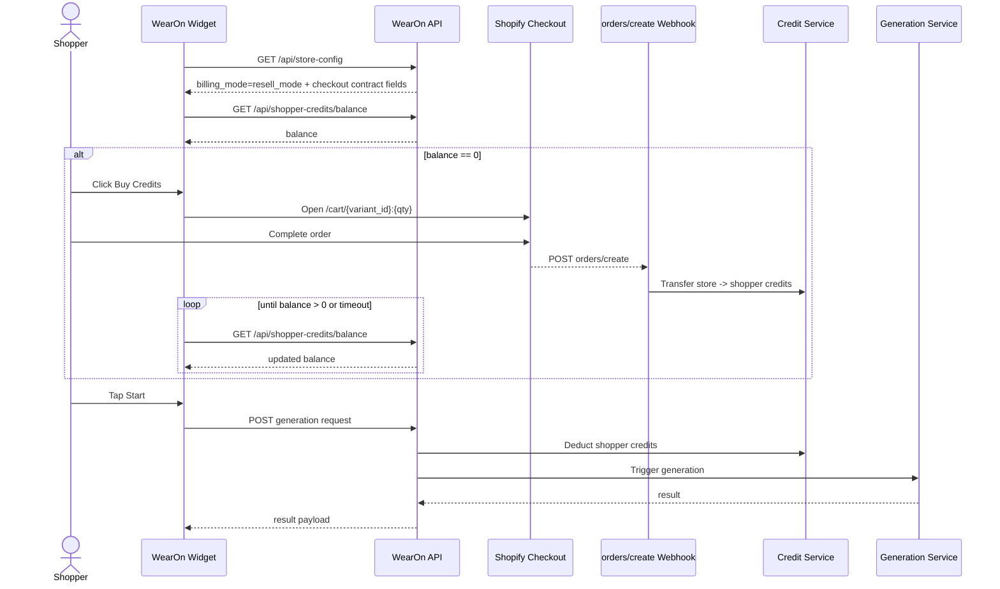
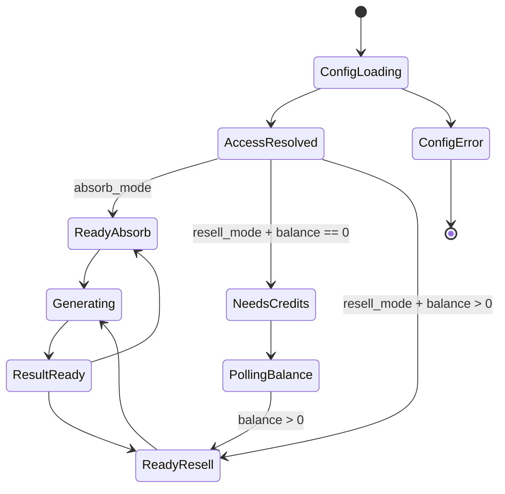

# WearOn Shopify Extension - API Contracts (Main)

## Scope
This document captures API contracts used or required by the `wearon-shopify` extension runtime.

## Runtime Endpoints Consumed by Widget

### GET `/api/store-config`
Purpose: Resolve store billing/access mode and storefront display behavior.

Expected response payload (observed in runtime parsing):

```json
{
  "data": {
    "billing_mode": "absorb_mode|resell_mode",
    "retail_credit_price": 0.5,
    "shop_domain": "store.myshopify.com",
    "shopify_variant_id": "123456789"
  }
}
```

Behavioral contract:
- If billing mode is `absorb_mode`, login is not required for shopper flow.
- If billing mode is `resell_mode`, login and shopper credit checks are required.
- On config errors, widget fails closed (requires login / blocks privileged flow).

### GET `/api/shopper-credits/balance`
Purpose: Retrieve shopper credit state for resell mode.

Expected response payload:

```json
{
  "data": {
    "balance": 2,
    "total_purchased": 5,
    "total_spent": 3
  }
}
```

Behavioral contract:
- `balance === 0` triggers purchase CTA flow.
- After checkout, widget polls this endpoint until credits appear or timeout.

## Contract Interaction Diagram (Resell Flow)


## Checkout Link Contract

### Direct cart checkout URL
Widget builds a Shopify cart URL:

`https://{shop_domain}/cart/{shopify_variant_id}:{quantity}`

Behavioral contract:
- Opens in new tab with `noopener,noreferrer`.
- Requires valid shop domain + variant id from config.

## Platform-side Contracts Required by Product Plan
(derived from PRD/Epics/implementation stories)

### POST `/api/v1/webhooks/shopify/orders`
Purpose: Process Shopify `orders/create` webhooks for resell credit purchases.

Required behaviors:
- Verify Shopify HMAC signature.
- Idempotent handling by `shopify_order_id`.
- Deduct store wholesale credits and credit shopper balance atomically.

### Generation + credit orchestration (platform)
Planned/required integration for shopper flow:
- Generation request endpoint(s) for B2B widget flow.
- Credit deduction/refund tied to generation success/failure.

## Security and Compliance Expectations
- Domain-scoped access and tenant isolation per store.
- No plaintext shopper PII in analytics logs.
- No camera or biometric capture in target storefront extension flow.
- Extension-level age verification is not required in the no-camera target flow.

## Age Verification Decision
- Why it existed before: age gates are typically introduced when capturing camera media or processing youth-sensitive personal data.
- Why removed now: this target flow has no camera pipeline and no age-based branching in the extension runtime.
- Remaining requirement boundary: if legal/compliance introduces market-specific age obligations later, enforce in policy layer and backend auth/contracts, not as a blanket storefront gate.

## Runtime State Contract (Widget)


## Traceability
- Code: `extensions/wearon-tryon/assets/tryon-privacy-flow.js`, `extensions/wearon-tryon/assets/tryon-widget.js`
- Planning/implementation docs are maintained outside this generated doc set for this run.
