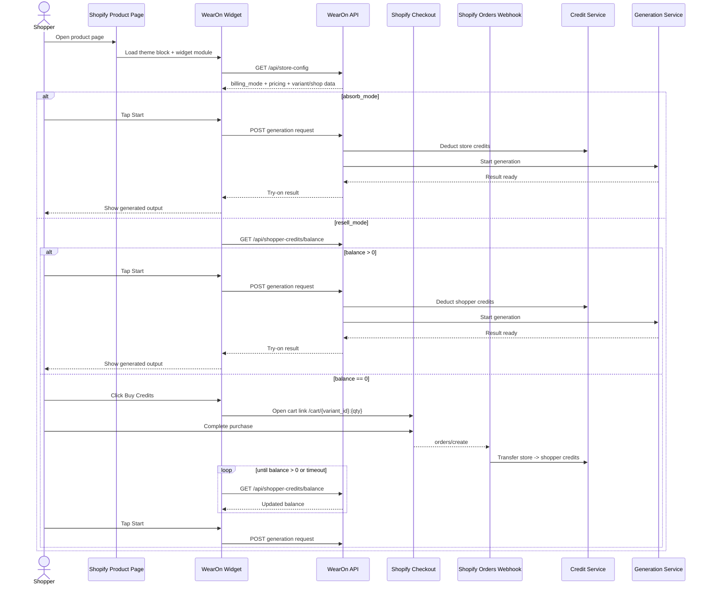
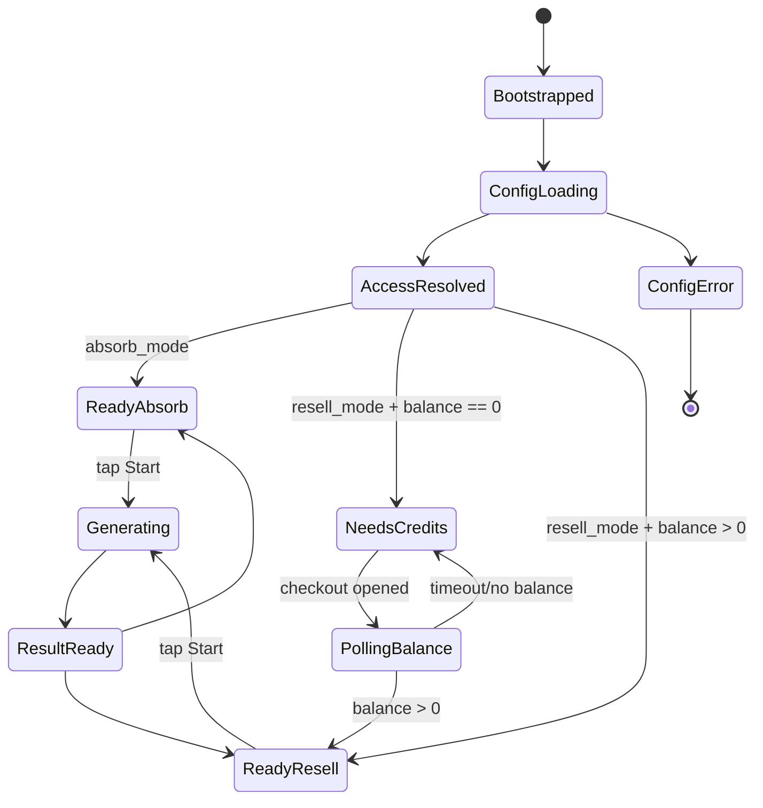
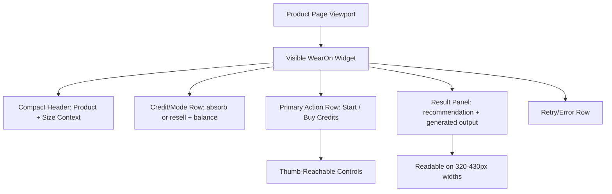

# WearOn Shopify Extension - Architecture

**Date:** 2026-02-18
**Part:** main
**Type:** Shopify Theme App Extension (single-part)

## Executive Summary
This repository delivers the storefront extension layer for WearOn’s Shopify channel. The target architecture is a mobile-first, always-visible shopper widget on product pages. It orchestrates access mode, shopper credits, and generation/result states without camera capture or age-verification gates, while delegating billing/webhook/store lifecycle responsibilities to upstream platform services.

## Technology Stack

| Category | Technology | Version/Signal | Why It Is Used |
|---|---|---|---|
| Platform | Shopify App + Theme App Extension | `shopify.app.toml`, webhooks `2026-01` | Native storefront embedding and app distribution model |
| Language | JavaScript (ES Modules) | `package.json` `type: module` | Lightweight storefront runtime without framework lock-in |
| Theme Templating | Liquid | `blocks/tryon-block.liquid` | Inject host container and widget script on product pages |
| UI Runtime | Vanilla DOM + Shadow DOM | `tryon-widget.js` | Prevent host-theme CSS conflicts and keep widget isolated |
| Testing | Vitest | `package.json` test script + `__tests__/` | Fast behavioral tests for widget/accessibility/size-rec |

## Architecture Pattern
### Primary Pattern
Embedded storefront widget with API-driven access-control state machine and mobile-first visible UI.

### Architectural Characteristics
- Theme block injects widget host and module asset only on product pages.
- Widget creates an isolated Shadow DOM UI tree.
- Widget is visible on first render and optimized for mobile viewport first.
- Runtime state is local to widget instance with minimal session-backed persistence.
- Access mode (`absorb_mode` vs `resell_mode`) is resolved through configuration API and controls flow.
- Resell mode adds credit-balance checks, checkout link generation, and credit polling behavior.
- No camera capture flow and no extension-level age-verification gate in target UX.

### Runtime Flow Diagram (Mobile-First, No-Camera)

### Widget State Diagram

### Mobile-First UI Diagram

### UI Artifact Code
- Runnable prototype: `docs/artifacts/mobile-first-widget-prototype.html`
- Purpose: visual reference for mobile-first hierarchy, absorb/resell states, no-camera UI.
- Open in browser to inspect states (`ready`, `loading`, `result`, `error`) and mode/credit combinations.

## Data Architecture
This repository has no local database schema. It consumes/depends on upstream store and shopper credit models.

### Data Entities Used by Runtime (via upstream APIs)
- Store access config: billing mode, retail credit price, shop domain, Shopify variant id.
- Shopper credit data: balance, purchased total, spent total.

### Client-Side Session State
- No mandatory camera/privacy/age gate session keys are required in this target flow.
- Optional keys can be used for non-sensitive UI preferences (for example, collapsed/expanded widget state).

## API Design
### Runtime-consumed endpoints
- `GET /api/store-config`
- `GET /api/shopper-credits/balance`

### Checkout Contract
- `https://{shop_domain}/cart/{shopify_variant_id}:{quantity}`

### Upstream-required endpoint (platform-side)
- `POST /api/v1/webhooks/shopify/orders`

This endpoint is critical for resell credit fulfillment and idempotent webhook handling.

## Component Overview
### Bootstrapping
- `blocks/tryon-block.liquid`: product-page host + module script

### Core Runtime Modules
- `assets/tryon-widget.js`: widget assembly, UI state, mobile-first interaction flow
- `assets/tryon-privacy-flow.js`: config + balance API helpers, checkout helpers (age/camera gating removed in target design)
- `assets/size-rec-display.js`: size recommendation formatting and safety guards

### Accessibility Components
- ARIA labels and live-region updates
- Focus-visible and touch-target guarantees
- Forced-colors support and mobile-first readable hierarchy

## Source Tree (Key Paths)
- `extensions/wearon-tryon/blocks/tryon-block.liquid`
- `extensions/wearon-tryon/assets/tryon-widget.js`
- `extensions/wearon-tryon/assets/tryon-privacy-flow.js`
- `extensions/wearon-tryon/assets/size-rec-display.js`
- `__tests__/tryon-widget.test.js`
- `__tests__/tryon-privacy-flow.test.js`
- `__tests__/tryon-accessibility.test.js`
- `__tests__/size-rec-display.test.js`

## Development Workflow
### Local Commands
- `npm test`
- `node ../node_modules/vitest/vitest.mjs run`

### Working Model
- Update runtime modules under `extensions/wearon-tryon/assets/`
- Keep Liquid host contract stable in `blocks/tryon-block.liquid`
- Validate behavior through focused test suites in `__tests__/`

## Deployment Architecture
This repo does not include direct CI/CD or infrastructure manifests. Deployment concerns are split:
- Extension assets/config are managed as Shopify app extension artifacts.
- OAuth/store registration/webhook/credit backends are implemented in upstream platform repositories.

## Testing Strategy
### Current Coverage
- Widget rendering and lifecycle flow
- Resell/absorb flow decisions and credit polling behavior
- Accessibility-oriented assertions (aria/focus/touch-target/contrast)
- Size recommendation formatting/sanitization guards

### Residual Risks
- Browser-realistic E2E checks are not represented in this repo.
- Mobile-only interaction edge cases (keyboard overlays, orientation change, low-width layout) need explicit regression tests.

## Constraints for Future Changes
- Preserve sandbox isolation to avoid theme breakage.
- Preserve no-camera architecture unless a new legal/privacy review reintroduces capture.
- Maintain absorb/resell behavioral parity with upstream billing contracts.
- Keep checkout/cart-link and balance-polling logic aligned with platform API contracts.
